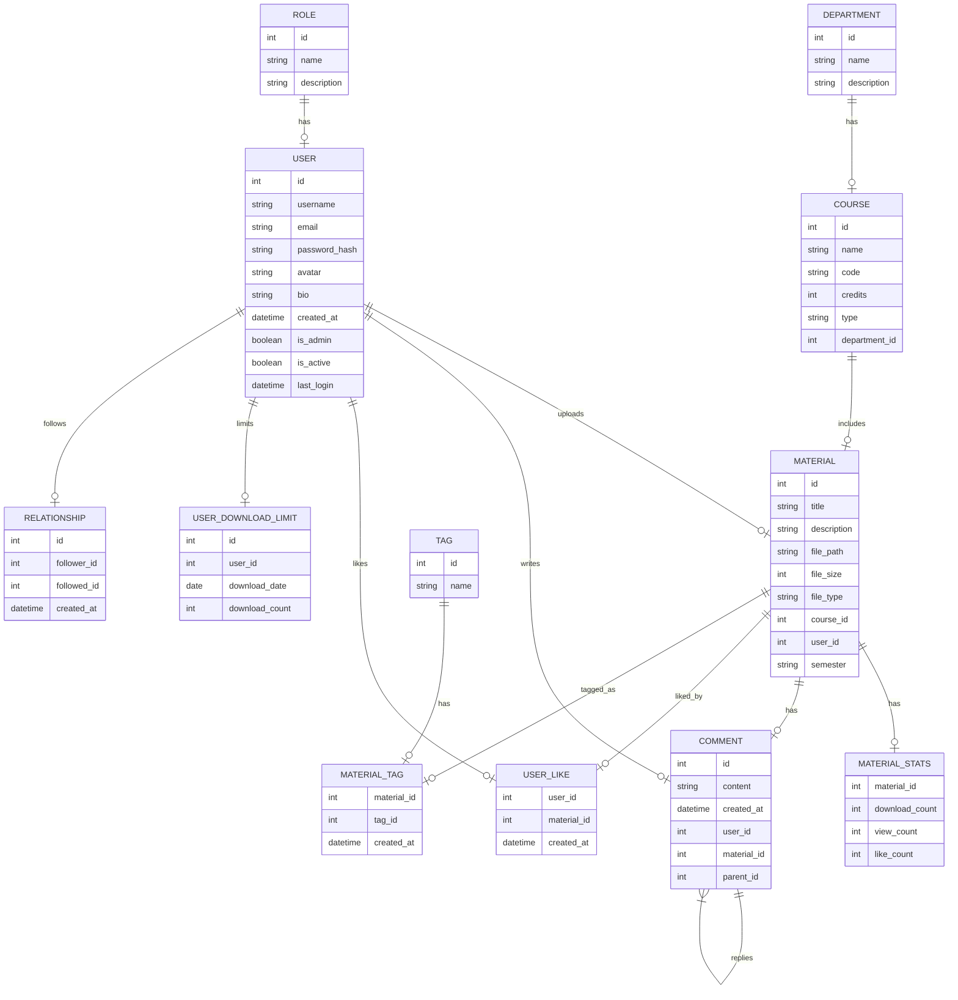

# 总览




# 表定义

## 1. Department（院系）表

```python
class Department(db.Model):
    __tablename__ = "department"
    
    # 主键
    id = db.Column(db.Integer, primary_key=True)
    # 院系名称，唯一且索引
    name = db.Column(db.String(50), unique=True, index=True, nullable=False)
    # 院系描述
    description = db.Column(db.Text)
    
    # 关系
    courses = db.relationship("Course", backref="department", lazy="dynamic", cascade="all, delete-orphan")
```

## 2. User（用户）表

```python
class User(UserMixin, db.Model):
    __tablename__ = "user"
    
    # 主键
    id = db.Column(db.Integer, primary_key=True)
    # 用户名
    username = db.Column(db.String(20), unique=True, nullable=False, index=True)
    # 邮箱
    email = db.Column(db.String(120), unique=True, nullable=False, index=True)
    # 密码哈希
    password_hash = db.Column(db.String(128), nullable=False)
    # 头像文件名
    avatar = db.Column(db.String(20), nullable=False, default="default.jpg")
    # 个人简介
    bio = db.Column(db.Text)
    # 创建时间
    created_at = db.Column(db.DateTime, default=func.now(), nullable=False)
    # 是否为管理员
    is_admin = db.Column(db.Boolean, default=False)
    # 账户状态 (激活/禁用)
    is_active = db.Column(db.Boolean, default=True)
    # 最后登录时间
    last_login = db.Column(db.DateTime)
    
    # 关系
    materials = db.relationship("Material", backref="uploader", lazy="dynamic", cascade="all, delete-orphan")
    comments = db.relationship("Comment", backref="author", lazy="dynamic", cascade="all, delete-orphan")
    likes = db.relationship("UserLike", backref="user", lazy="dynamic", cascade="all, delete-orphan")
    downloads = db.relationship("UserDownloadLimit", backref="user", lazy="dynamic", cascade="all, delete-orphan")
    
    # 关注者关系
    followers = db.relationship(
        "Relationship",
        foreign_keys="Relationship.followed_id",
        backref=db.backref("followed", lazy="joined"),
        lazy="dynamic",
        cascade="all, delete-orphan"
    )
    
    # 关注的人关系
    following = db.relationship(
        "Relationship",
        foreign_keys="Relationship.follower_id",
        backref=db.backref("follower", lazy="joined"),
        lazy="dynamic",
        cascade="all, delete-orphan"
    )
```

## 3. Course（课程）表

```python
class Course(db.Model):
    __tablename__ = "course"
    
    # 主键
    id = db.Column(db.Integer, primary_key=True)
    # 课程名称
    name = db.Column(db.String(100), index=True, nullable=False)
    # 课程代码，唯一
    code = db.Column(db.String(20), unique=True, index=True, nullable=False)
    # 学分，存储为整数(如3.0学分存为300)
    credits = db.Column(db.Integer, nullable=False)
    # 课程类型
    type = db.Column(db.String(100), index=True, nullable=False)
    # 课时数
    hours = db.Column(db.Integer, nullable=False)
    # 课程描述
    description = db.Column(db.Text)
    # 所属院系ID
    department_id = db.Column(db.Integer, db.ForeignKey("department.id", ondelete="CASCADE"), index=True, nullable=False)
    # 创建时间
    created_at = db.Column(db.DateTime, default=func.now(), nullable=False)
    # 更新时间
    updated_at = db.Column(db.DateTime, default=func.now(), onupdate=func.now())
    # 乐观锁版本号
    version = db.Column(db.Integer, default=0)
    
    # 关系
    materials = db.relationship("Material", backref="course", lazy="dynamic", cascade="all, delete-orphan")
    
    # 索引
    __table_args__ = (
        # 复合索引：按照院系ID和课程名称查询
        db.Index("ix_dept_course_name", "department_id", "name"),
    )
```

## 4. Material（资料）表

```python
class Material(db.Model):
    __tablename__ = "material"
    
    # 主键
    id = db.Column(db.Integer, primary_key=True)
    # 资料标题
    title = db.Column(db.String(200), nullable=False, index=True)
    # 资料描述
    description = db.Column(db.Text)
    # 文件存储路径
    file_path = db.Column(db.String(255), nullable=False)
    # 文件大小(bytes)
    file_size = db.Column(db.Integer, default=0)
    # 资料类型(试卷/笔记等)
    file_type = db.Column(db.String(50), nullable=False, index=True)
    # 关联课程ID
    course_id = db.Column(db.Integer, db.ForeignKey("course.id", ondelete="CASCADE"), index=True, nullable=False)
    # 上传用户ID
    user_id = db.Column(db.Integer, db.ForeignKey("user.id", ondelete="CASCADE"), index=True, nullable=False)
    # 上传时间
    created_at = db.Column(db.DateTime, default=func.now(), nullable=False)
    # 更新时间
    updated_at = db.Column(db.DateTime, default=func.now(), onupdate=func.now())
    # 文件扩展名
    file_extension = db.Column(db.String(20))
    # 学期
    semester = db.Column(db.String(50), index=True)
    # 原始文件名
    original_filename = db.Column(db.String(255))
    # 乐观锁版本号
    version = db.Column(db.Integer, default=0)
    
    # 关系
    comments = db.relationship("Comment", backref="material", lazy="dynamic", cascade="all, delete-orphan")
    stats = db.relationship("MaterialStats", uselist=False, backref="material", cascade="all, delete-orphan")
    likes = db.relationship("UserLike", backref="material", lazy="dynamic", cascade="all, delete-orphan")
    
    # 复合索引
    __table_args__ = (
        # 按照课程ID和创建时间查询
        db.Index("ix_course_created", "course_id", "created_at"),
        # 按照类型和创建时间查询
        db.Index("ix_type_created", "file_type", "created_at"),
    )
    
    # 方法
    def increment_download_count(self)  # 增加下载计数
    def increment_view_count(self)      # 增加浏览计数
    def toggle_like(self, user_id)      # 切换点赞状态
    def is_liked_by(self, user_id)      # 检查是否被点赞
```

## 5. MaterialStats（资料统计）表

```python
class MaterialStats(db.Model):
    __tablename__ = "material_stats"
    
    # 使用外键作为主键
    material_id = db.Column(db.Integer, db.ForeignKey("material.id", ondelete="CASCADE"), primary_key=True)
    # 下载次数统计
    download_count = db.Column(db.Integer, default=0)
    # 查看次数统计
    view_count = db.Column(db.Integer, default=0)
    # 点赞次数统计
    like_count = db.Column(db.Integer, default=0)
```

## 6. Comment（评论）表

```python
class Comment(db.Model):
    __tablename__ = "comment"
    
    # 主键
    id = db.Column(db.Integer, primary_key=True)
    # 评论内容
    content = db.Column(db.Text, nullable=False)
    # 评论时间
    created_at = db.Column(db.DateTime, default=func.now(), nullable=False)
    # 评论用户ID
    user_id = db.Column(db.Integer, db.ForeignKey("user.id", ondelete="CASCADE"), index=True, nullable=False)
    # 评论资料ID
    material_id = db.Column(db.Integer, db.ForeignKey("material.id", ondelete="CASCADE"), index=True, nullable=False)
    # 父评论ID（用于回复功能）
    parent_id = db.Column(db.Integer, db.ForeignKey("comment.id", ondelete="CASCADE"))
    
    # 自引用关系
    replies = db.relationship("Comment", backref=db.backref("parent", remote_side=[id]), lazy="dynamic")
```

## 7. Role（角色）表

```python
class Role(db.Model):
    __tablename__ = "role"
    
    # 主键
    id = db.Column(db.Integer, primary_key=True)
    # 角色名称
    name = db.Column(db.String(80), unique=True, nullable=False)
    # 角色描述
    description = db.Column(db.String(255))
    
    # 多对多关系需要通过关联表与用户关联
    users = db.relationship("User", secondary="user_roles", backref=db.backref("roles", lazy="dynamic"))
```

## 8. Relationship（关注关系）表

```python
class Relationship(db.Model):
    __tablename__ = 'relationships'
    
    # 主键
    id = db.Column(db.Integer, primary_key=True)
    # 关注者ID
    follower_id = db.Column(db.Integer, db.ForeignKey('user.id', ondelete="CASCADE"), nullable=False)
    # 被关注者ID
    followed_id = db.Column(db.Integer, db.ForeignKey('user.id', ondelete="CASCADE"), nullable=False)
    # 创建时间
    created_at = db.Column(db.DateTime, default=func.now(), nullable=False)
    
    # 唯一约束，确保同一用户不会重复关注同一个人
    __table_args__ = (
        db.UniqueConstraint('follower_id', 'followed_id', name='uq_user_relationship'),
    )
```

## 9. UserLike（用户点赞/收藏）表

```python
class UserLike(db.Model):
    __tablename__ = "user_like"
    
    # 复合主键
    user_id = db.Column(db.Integer, db.ForeignKey("user.id", ondelete="CASCADE"), primary_key=True)
    material_id = db.Column(db.Integer, db.ForeignKey("material.id", ondelete="CASCADE"), primary_key=True)
    # 创建时间
    created_at = db.Column(db.DateTime, default=func.now(), nullable=False)
```

## 10. UserDownloadLimit（用户下载限制）表

```python
class UserDownloadLimit(db.Model):
    __tablename__ = "user_download_limit"
    
    # 主键
    id = db.Column(db.Integer, primary_key=True)
    # 用户ID
    user_id = db.Column(db.Integer, db.ForeignKey("user.id", ondelete="CASCADE"), nullable=False)
    # 下载日期
    download_date = db.Column(db.Date, nullable=False, default=date.today)
    # 当日下载次数
    download_count = db.Column(db.Integer, default=0)
    
    # 复合索引：按用户ID和日期查询
    __table_args__ = (
        db.Index("ix_user_date", "user_id", "download_date"),
        db.UniqueConstraint("user_id", "download_date", name="uq_user_date")
    )
```

## 11. Tag（标签）表

```python
class Tag(db.Model):
    __tablename__ = "tag"
    
    # 主键
    id = db.Column(db.Integer, primary_key=True)
    # 标签名称
    name = db.Column(db.String(50), unique=True, nullable=False, index=True)
    
    # 多对多关系通过MaterialTag关联表实现
    materials = db.relationship("Material", secondary="material_tag", backref="tags")
```

## 12. MaterialTag（资料标签关联）表

```python
class MaterialTag(db.Model):
    __tablename__ = "material_tag"
    
    # 复合主键
    material_id = db.Column(db.Integer, db.ForeignKey("material.id", ondelete="CASCADE"), primary_key=True)
    tag_id = db.Column(db.Integer, db.ForeignKey("tag.id", ondelete="CASCADE"), primary_key=True)
    # 创建时间
    created_at = db.Column(db.DateTime, default=func.now(), nullable=False)
    
    # 复合索引
    __table_args__ = (
        db.Index("ix_material_tag", "material_id", "tag_id"),
    )
```

这些表和字段组成了完整的PKUHUB数据库架构，支持用户管理、课程资源共享、社交互动等各种功能需求。各表之间通过外键与关系属性形成复杂的关联，保证了数据的完整性和一致性。

# 表操作

正在收集工作区信息# PKUHUB 数据库操作技术文档

## 概述

PKUHUB 项目使用 SQLite 数据库，通过 SQLAlchemy ORM 管理。数据库操作封装在 database 包中，提供了一系列标准化的 CRUD 接口。这种设计使得业务逻辑层不需要直接编写 SQL 语句，只需调用相应的函数即可。

## 数据库操作函数分类

### 1. 用户相关操作

```python
# 创建新用户
create_user(username, email, password, **kwargs)

# 获取用户信息
get_user(method="id", key=None, limit=None)

# 更新用户信息
update_user(user_id, **kwargs)

# 删除用户
delete_user(user_id)
```

#### 用法示例:

```python
# 创建用户
user = database.create_user("张三", "zhangsan@example.com", "password123", 
                           bio="这是我的个人简介")

# 通过ID获取用户
user = database.get_user(method="id", key=1)

# 通过邮箱获取用户
user = database.get_user(method="email", key="zhangsan@example.com")

# 更新用户资料
updated_user = database.update_user(1, username="李四", bio="新的个人简介")

# 删除用户
success = database.delete_user(1)
```

### 2. 资料相关操作

```python
# 创建新资料
create_material(title, description, file_path, file_type, course_id, user_id, **kwargs)

# 获取资料
get_material(method="id", key=None, limit=None)

# 更新资料
update_material(material_id, **kwargs)

# 删除资料
delete_material(material_id)
```

#### 用法示例:

```python
# 创建资料
material = database.create_material(
    title="高等数学期末复习资料",
    description="包含近五年真题和解析",
    file_path="uploads/math/calculus_final_review.pdf",
    file_type="笔记",
    course_id=5,
    user_id=1,
    semester="2023秋季"
)

# 获取特定资料
material = database.get_material(method="id", key=10)

# 获取特定课程的所有资料
materials = database.get_material(method="course_id", key=5)

# 获取特定用户上传的所有资料
materials = database.get_material(method="user_id", key=1)

# 获取所有资料
all_materials = database.get_material(method="all")

# 更新资料信息
updated_material = database.update_material(10, title="高等数学期末复习全集", description="更新后的描述")

# 删除资料
success = database.delete_material(10)
```

### 3. 课程相关操作

```python
# 创建新课程
create_course(name, code, credits, type, department_id, **kwargs)

# 获取课程
get_course(method="id", key=None, limit=None)

# 更新课程
update_course(course_id, **kwargs)

# 删除课程
delete_course(course_id)
```

#### 用法示例:

```python
# 创建课程
course = database.create_course(
    name="高等数学(A)",
    code="MATH101",
    credits=300,  # 3.0学分存储为300
    type="专业必修",
    department_id=3,
    hours=48
)

# 获取课程
course = database.get_course(method="id", key=5)

# 获取某院系的所有课程
courses = database.get_course(method="department_id", key=3)

# 更新课程信息
updated_course = database.update_course(5, name="高等数学(A+)", credits=400)

# 删除课程
success = database.delete_course(5)
```

### 4. 评论相关操作

```python
# 创建评论
create_comment(content, user_id, material_id, parent_id=None)

# 获取评论
get_comment(method="id", key=None, limit=None)

# 更新评论
update_comment(comment_id, content)

# 删除评论
delete_comment(comment_id)
```

#### 用法示例:

```python
# 创建评论
comment = database.create_comment(
    content="这份资料非常有用，谢谢分享!",
    user_id=2,
    material_id=10
)

# 创建回复评论
reply = database.create_comment(
    content="不客气，希望对你有帮助。",
    user_id=1,
    material_id=10,
    parent_id=comment.id
)

# 获取特定资料的所有评论
comments = database.get_comment(method="material_id", key=10)

# 获取用户的所有评论
user_comments = database.get_comment(method="user_id", key=2)

# 更新评论
updated_comment = database.update_comment(comment.id, "这份资料真的非常有用，强烈推荐!")

# 删除评论
success = database.delete_comment(comment.id)
```

### 5. 高级查询功能

```python
# 课程高级查询
query_courses(criteria=None, sort_by=None, limit=None)

# 资料高级查询
query_materials(criteria=None, sort_by=None, limit=None)

# 获取所有课程类型
get_course_types()

# 获取所有资料类型
get_material_types()
```

#### 用法示例:

```python
# 查询某院系的所有专业必修课程
courses = database.query_courses(
    criteria={"department_id": 3, "type": "专业必修"},
    sort_by="name"
)

# 查询最近上传的PDF资料
materials = database.query_materials(
    criteria={"file_extension": ".pdf"},
    sort_by="created_at",
    limit=10
)

# 获取所有课程类型列表
course_types = database.get_course_types()
# 返回: ["专业必修", "专业选修", "专业任选", "通选课", "公共课", "其他"]

# 获取所有资料类型列表
material_types = database.get_material_types()
# 返回: ["试卷", "笔记", "课件", "习题", "答案", "汇编", "其他"]
```

### 6. 用户关系操作

```python
# 检查是否关注
is_following(follower_id, followed_id)

# 关注用户
follow_user(follower_id, followed_id)

# 取消关注
unfollow_user(follower_id, followed_id)

# 获取关注列表
get_following(user_id)

# 获取粉丝列表
get_followers(user_id)
```

#### 用法示例:

```python
# 检查用户1是否关注了用户2
if database.is_following(1, 2):
    print("已关注")

# 用户1关注用户2
success = database.follow_user(1, 2)

# 用户1取消关注用户2
success = database.unfollow_user(1, 2)

# 获取用户1关注的所有用户
following = database.get_following(1)

# 获取用户2的所有粉丝
followers = database.get_followers(2)
```

## 数据库操作实现细节

### 错误处理

所有数据库操作函数遵循一致的错误处理模式:

1. 使用 `try-except` 块捕获可能的数据库异常
2. 发生异常时自动回滚事务
3. 记录详细错误日志
4. 返回适当的成功/失败指示

```python
try:
    # 执行数据库操作
    db.session.add(new_entity)
    db.session.commit()
    return new_entity
except Exception as e:
    db.session.rollback()
    logger.error(f"数据库操作失败: {str(e)}")
    return None
```

### 乐观锁实现

对于高频并发更新的操作，使用乐观锁机制防止数据竞争:

```python
def increment_download_count(self):
    """增加下载计数 - 使用乐观锁和原生SQL实现高并发下的计数更新"""
    if not self.stats:
        self.stats = MaterialStats(material_id=self.id)
        db.session.add(self.stats)

    # 尝试最多5次更新，应对高并发下的竞争失败情况
    for attempt in range(5):
        try:
            # 使用原生SQL直接更新计数，避免读取-修改-写入的竞争条件
            result = db.session.execute(
                text("UPDATE material_stats SET download_count = download_count + 1 "
                     "WHERE material_id = :material_id"),
                {"material_id": self.id}
            )
            db.session.commit()
            # 如果影响了行数,说明更新成功
            if result.rowcount > 0:
                return True
        except Exception as e:
            db.session.rollback()
            # 如果是最后一次尝试失败,则抛出异常
            if attempt == 4:
                raise e
    return False
```

### 查询优化

对于常用查询路径，使用复合索引提高性能:

```python
__table_args__ = (
    # 复合索引：按照课程ID和创建时间查询
    db.Index("ix_course_created", "course_id", "created_at"),
    # 复合索引：按照类型和创建时间查询
    db.Index("ix_type_created", "file_type", "created_at"),
)
```

### 参数校验

所有操作函数在执行数据库操作前进行参数校验，确保数据的完整性和一致性:

```python
def create_material(title, description, file_path, file_type, course_id, user_id, **kwargs):
    """创建新资料记录"""
    # 参数校验
    if not title or not file_path or not file_type:
        logger.error("创建资料失败: 标题、文件路径和类型为必填项")
        return None
    
    if not isinstance(course_id, int) or not isinstance(user_id, int):
        logger.error("创建资料失败: 课程ID和用户ID必须为整数")
        return None
    
    # 检查课程和用户是否存在
    course = get_course(method="id", key=course_id)
    user = get_user(method="id", key=user_id)
    
    if not course or not user:
        logger.error(f"创建资料失败: 无效的课程ID({course_id})或用户ID({user_id})")
        return None
    
    # 创建资料记录
    try:
        # 实现...
    except Exception as e:
        # 错误处理...
```

## 注意事项

1. **事务管理**: 所有修改操作都在事务中执行，确保数据一致性
2. **懒加载**: 关系查询使用懒加载(`lazy="dynamic"`)，避免不必要的数据加载
3. **级联删除**: 所有模型关系定义了适当的级联行为，确保数据引用完整性
4. **安全性**: 用户密码使用 Werkzeug 安全哈希函数存储
5. **并发控制**: 高频更新操作使用乐观锁和原子更新
6. **索引优化**: 为常用查询路径创建了适当的索引

## 数据库模型与关系

所有数据库操作函数操作的是以下数据库模型:

- `User`: 用户信息
- `Material`: An 上传资料
- `Course`: 课程信息
- `Department`: 院系信息
- `Comment`: 评论
- `MaterialStats`: 资料统计信息
- `Role`: 用户角色
- `Relationship`: 用户关注关系

这些模型之间的关系已在模型定义中通过外键和关系属性建立，操作函数利用这些关系实现各种复杂查询。

## 调用示例

### 上传资料过程的数据库操作:

```python
# 1. 验证是否存在课程，若不存在则创建
course = database.get_course(method="name", key=course_name)
if not course:
    course = database.create_course(
        name=course_name,
        code=f"AUTO-{uuid.uuid4().hex[:8]}",
        credits=0,
        type=course_type,
        department_id=department_id
    )

# 2. 创建资料记录
material = database.create_material(
    title=title,
    description=description,
    file_path=file_path,
    file_type=material_type,
    course_id=course.id,
    user_id=current_user.id,
    file_size=file_size,
    file_extension=file_extension,
    original_filename=original_filename,
    semester=semester
)

# 3. 通知关注者
followers = database.get_followers(current_user.id)
for follower in followers:
    notify_user(follower.id, f"{current_user.username}上传了新资料: {title}")