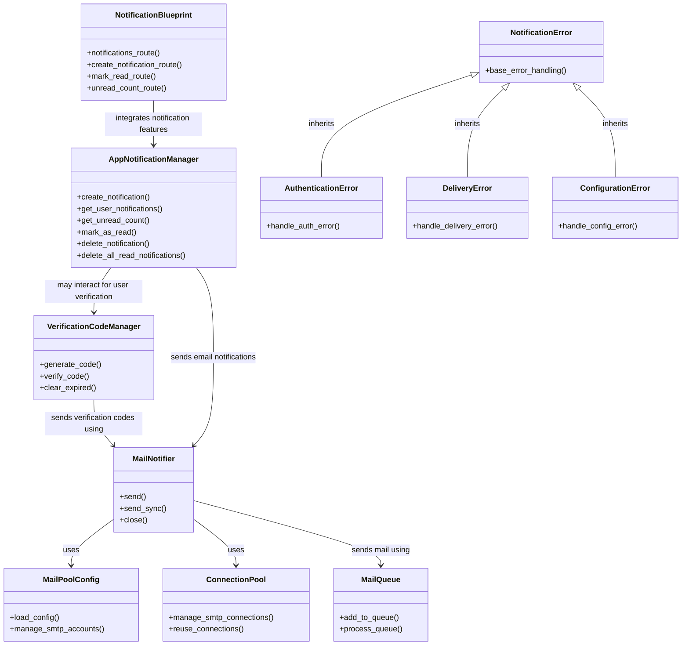

# 总览




# 定义

通知模块(notification)是PKUHUB系统的核心组件，提供了三个主要功能:

1. 邮件通知系统 - 发送邮件验证码和通知
2. 验证码管理系统 - 生成、验证和管理验证码
3. 应用内通知系统 - 管理网站内部的通知功能

## 1. 模块组织结构

通知模块由以下几个主要文件组成:

- `__init__.py` - 模块入口点和符号导出
- `base.py` - 邮件通知系统的核心实现
- `verification_code.py` - 验证码功能的实现
- `app_notification.py` - 应用内通知系统的实现

## 2. 邮件通知系统

### 2.1 `MailNotifier` 类

邮件通知器是通知系统的核心类，负责发送邮件通知。实现为单例模式，确保所有实例共享相同的连接池和配置。

#### 主要方法:

- `send()` - 异步发送邮件（放入队列后立即返回）
- `send_sync()` - 同步发送邮件（阻塞直到完成）
- `close()` - 关闭所有连接和工作线程，释放资源

#### 使用示例:

```python
from notification import MailNotifier

notifier = MailNotifier()
notifier.send(
    to="student@stu.pku.edu.cn",
    subject="验证码",
    content="您的验证码是: 123456",
    content_type="html"  # 可选，默认为"plain"
)
```

### 2.2 配置系统

#### `MailPoolConfig` 类

负责加载和管理SMTP服务器配置及多个邮箱账户。自动从`.env`文件加载配置。

#### 配置示例:

```
# SMTP服务器配置
SMTP_HOST=smtp.yeah.net
SMTP_PORT=465

# 邮箱账户配置（可添加多个）
EMAIL_USER_1=example@yeah.net
EMAIL_PWD_1=password
EMAIL_PRIORITY_1=1
```

### 2.3 连接池系统

#### `ConnectionPool` 类

管理SMTP连接，支持多账户和连接复用，提高发送效率并实现负载均衡。

### 2.4 任务队列系统

#### `MailQueue` 类

实现多线程邮件发送队列，提高并发处理能力。

## 3. 验证码管理系统

### 3.1 `VerificationCodeManager` 类

管理验证码的生成、存储和验证。

#### 主要方法:

- `generate_code()` - 生成新验证码
- `verify_code()` - 验证用户提交的验证码
- `clear_expired()` - 清理过期验证码

### 3.2 辅助函数

- `code_generator` - 生成6位随机数字验证码
- `send_verification_codes` - 批量发送验证码邮件
- `verify_code` - 验证用户提交的验证码

#### 使用示例:

```python
from notification import send_verification_codes, verify_code

# 发送验证码
result = send_verification_codes(
    email_list=["student@stu.pku.edu.cn"],
    subject="验证码 - PKUHUB"
)

# 验证用户提交的验证码
is_valid = verify_code("student@stu.pku.edu.cn", "123456")
```

## 4. 应用内通知系统

### 4.1 `AppNotificationManager` 类

管理应用内通知的创建、存储、读取和标记已读等功能。实现为单例模式。

#### 主要方法:

- `create_notification()` - 创建新通知
- `get_user_notifications()` - 获取用户可见的通知
- `get_unread_count()` - 获取用户未读通知数量
- `mark_as_read()` - 标记通知为已读
- `delete_notification()` - 删除单个通知
- `delete_all_read_notifications()` - 删除所有已读通知

#### 使用示例:

```python
from notification import notification_manager

# 创建新通知
notification = notification_manager.create_notification(
    title="系统维护通知",
    content="系统将于今晚22:00-24:00进行维护",
    creator_id=1,  # 管理员ID
    target_role="all",  # 目标角色: all, admin, followers
    app_root_path=app.root_path  # Flask应用根目录
)

# 获取用户未读通知数量
unread_count = notification_manager.get_unread_count(
    user_id=current_user.id,
    is_admin=current_user.is_admin,
    app_root_path=app.root_path
)
```

## 5. 蓝图集成

### 5.1 `notification_bp`

提供面向用户的通知功能路由:

- `/notifications` - 查看所有通知
- `/notifications/create` - 创建新通知(仅管理员)
- `/notifications/<notification_id>/mark_read` - 标记通知为已读
- `/notifications/unread_count` - 获取未读通知数量

## 6. 与系统其他部分的集成

### 6.1 用户注册验证

在`templates/register.html`中，通过AJAX调用发送验证码API，接收验证码后完成注册。

### 6.2 头像显示未读通知数量

在`templates/nav.html`中，定期检查未读通知数量并在导航栏显示。

### 6.3 用户关注通知

当被关注的用户上传新资料时，系统会自动向关注者发送通知。

## 7. 异常处理

通知模块定义了多种异常类型:

- `NotificationError` - 所有通知相关异常的基类
- `AuthenticationError` - 当SMTP身份验证失败时抛出
- `DeliveryError` - 当邮件无法发送到目标收件人时抛出
- `ConfigurationError` - 当环境变量配置缺失或不正确时抛出

## 8. 安全考虑

- 所有密码都存储在`.env`文件中，不直接硬编码在代码中
- 使用SSL安全连接发送邮件
- 验证码有过期时间，提高安全性
- 邮箱验证确保用户身份的真实性

## 9. 性能优化

- 连接池复用SMTP连接，减少建立连接的开销
- 多线程任务队列提高并发处理能力
- 邮箱账户轮转机制，防止单个账户发送过多触发限制

---

通过这些组件的共同作用，PKUHUB提供了完整的通知解决方案，既支持通过邮件发送重要信息(如验证码)，又支持在网站内显示通知信息，提升了用户体验。